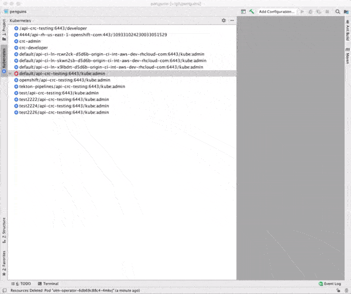

# Kubernetes

## Overview

JetBrains IDEA plugin for interacting with Kubernetes and OpenShift clusters.
The plugin provides functionalities and user experiences that are very close to the Kubernetes extension for vscode (https://marketplace.visualstudio.com/items?itemName=ms-kubernetes-tools.vscode-kubernetes-tools).

This plugin is currently in Preview Mode.



### Kubernetes & OpenShift resource tree
The plugin offers a tool window with a tree that displays all the resources that exist on a Kubernetes or OpenShift cluster.
The tree displays all the contexts that exist in your kube config (~/.kube/config).
The tree is dynamically updated when external tools like kubectl, oc, etc. change the kube config. 

#### Current Context
The tree displays resources that exist on the cluster that the current context points to. 
The user can switch the current context and cluster by choosing any context that's listed and picking "Set as Current Cluster" in the context menu.
OpenShift clusters are marked as such with an OpenShift icon instead of a Kubernetes icon.
 
#### Current Namespace/Project
The tree displays resources that exist within the current namespace as specified in the kube config or that are not bound to a namespace/project.
The user may switch the current namespace with the context menu item "Use Namespace". 
In OpenShift clusters the tree also lists projects which behave in an equivalent manner. 

#### Resource Categories
Resources are organized in different categories.


#### Pods
Pods are marked as running if their icon has a green dot. 
A red dot, on the contrary, indicates that a pod is either pending, succeeded (terminated), failed or is in an unknown state.
Pods also unveil their IP address and the number of running out of the total number of containers.


#### Delete Resources
Any resource that is listed may be deleted via the context menu.


**NOTE:** This plugin is in Preview mode. The plugin support for Kubernetes or OpenShift clusters is strictly experimental - assumptions may break, commands and behavior may change!

## Release notes
See the change log.

Contributing
============
This is an open source project open to anyone. This project welcomes contributions and suggestions!

For information on getting started, refer to the [CONTRIBUTING instructions](CONTRIBUTING.md).

Feedback & Questions
====================
If you discover an issue please file a bug and we will fix it as soon as possible.
* File a bug in [GitHub Issues](https://github.com/redhat-developer/intellij-kubernetes/issues).

UI Testing
==========
You can perform UI testing by running the following command:
```sh
./gradlew clean runIdeForUiTests -PideaVersion=IC-2020.2& ./gradlew integrationTest
```

License
=======
EPL 2.0, See [LICENSE](LICENSE) for more information.
