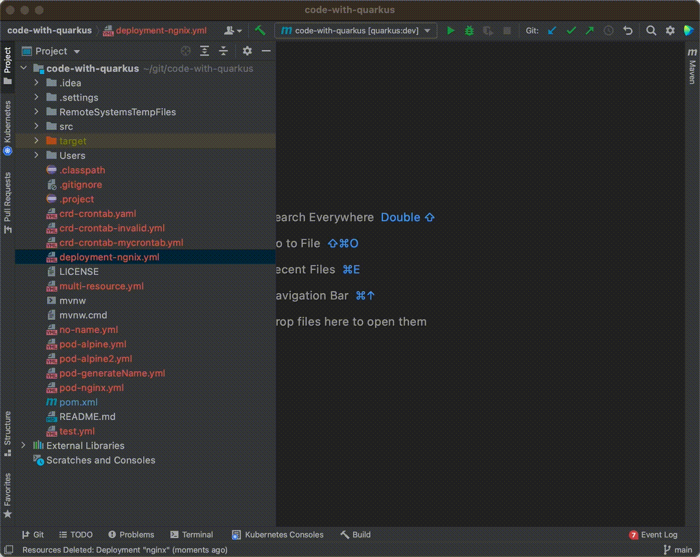
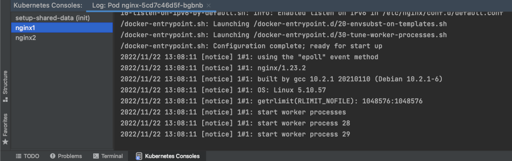

[](https://plugins.jetbrains.com/plugin/15921-kubernetes-by-red-hat)
[](https://plugins.jetbrains.com/plugin/15921-kubernetes-by-red-hat)
[](https://github.com/redhat-developer/intellij-kubernetes/actions/workflows/ci.yml?query=workflow%3ACI)
[](https://github.com/redhat-developer/intellij-kubernetes/blob/main/LICENSE)

# Kubernetes

## Overview

JetBrains IDEA plugin that allows to browse, create, modify and delete resources on Kubernetes or OpenShift clusters.
The plugin provides functionalities and user experiences that are very close to the [Kubernetes extension for Visual Studio Code](https://marketplace.visualstudio.com/items?itemName=ms-kubernetes-tools.vscode-kubernetes-tools).

It is available for install from the [JetBrains Marketplace](https://plugins.jetbrains.com/plugin/15921-kubernetes-by-red-hat).



## Key Features
 - Edit Kubernetes resource manifests and apply them to your cluster
 - View Kubernetes and OpenShift clusters in an explorer tree view
 - Tree View supports dynamic update of K8s resources
 - Push and Pull Feature to keep the editor in sync with the Kubernetes resource
 - Allows users to Push multiple resources in an editor to create several resources at once.
 - Support Creation and Deletion of Kubernetes resources on Cluster
 - Navigate into Kubernetes workloads, services, pods and nodes
 - Switching contexts and namespaces within Kubernetes
 - Follow logs from the connected cluster resource
 - Open a Terminal Shell to a Running Container in the connected cluster
 - Open the Dashboard for the connected cluster (works on any Hybrid cloud cluster)
 - Support [init containers](https://kubernetes.io/docs/concepts/workloads/pods/init-containers/) for logs and terminals.
 - Scale the replicated pods for deployments, deployment configs, replica/stateful sets or replication controllers

## Features

### Browse Kubernetes & OpenShift resources
This plugin allows the user to view the Kubernetes and OpenShift Cluster resources in a Tree and browse through them.
The explorer tree is dynamically updated in sync with the Kubernetes resources on the cluster so that the tree always display the current state of the resources.

#### Current Context
The user can switch the current context by choosing any context that exists and selecting `Set as Current Cluster` action from the context menu.
OpenShift clusters are shown with OpenShift icon and thus differentiated from Kubernetes clusters.

#### Current Namespace/Project
Kubernetes Resources that exist within the current Namespace/Project (as specified in kubeconfig file) are displayed in the tree view.
Non-namespaced aka cluster-scoped resources are of course listed, too.
Users can switch the current Namespace/Project using the context menu action `Use Namespace`
In OpenShift clusters the tree also lists projects where the tooling behaves in an equivalent manner.

#### Resource Categories
Resources are grouped in different categories such as Namespaces, Nodes, Workloads, Network, Storage, Configuration and Custom Resources.


#### Pods
The pod in the container is identified with color based on the state of the pod.
- A green dot indicates that the pod is currently running.
- A red dot indicates that the pod is in Pending, Succeeded (Terminated), Failed or in Unknown State.


Pods also unveil their IP address and the number of running containers out of the total number of containers.

### Create and Edit Resources
You can edit Kubernetes resources that is shown in the resource tree and apply them to the cluster.
The action can be performed either by `Double Click on Resource` or selecting `Edit` action from the context menu.
This opens the resource YAML file in the editor and allows the user to make the necessary changes.
Pushing the editor to the cluster updates the resource on the cluster or creates a new resource if it didn't exist yet.
Users can also create a new Kubernetes resource from local YAML/JSON file.


The editor validates your content on behalf of a schema that's matching your kubernetes resource.
For instance if you're editing a pod, the editor validates it by a kubernetes pod schema and highlights the portions that are infringing.


#### Push (Save) to Cluster

User can push the local changes made to the cluster in order to update an existing resource or create a new resource.
The editor is saving the changes to the current context (cluster, namespace and user) that's defined in the kubeconfig.
There is a `Push` button available in the editor toolbar to make the action more discoverable.


Alternatively the editor notifies you whenever you may push your content to the cluster.
Clicking the `Push` link in the editor notification saves your file changes on to the cluster.


Pushing updates the resource on the cluster or creates a new resource if it doesn't exist yet.
The new resource will then appear in the resource tree that's displayed in our tool window.

#### Pull (Load) from Cluster

You can `Pull` the resource from the cluster into the local file opened in the editor. 
Clicking on the `Pull` icon in the toolbar replaces the content of your local file in the editor with the version that exists on the cluster.


#### Diff

The editor allows you to compare the local content with the resource content on the cluster.
The toolbar holds an action that opens up a fully editable diff that highlights the differences.


The very same dialog may also be opened with a link that's present in the notification toolbar.


#### Delete Resources
You may delete any resource that is listed in the resource tree by choosing "Delete" in the context menu.

#### Scale Replicated Pods
You may scale a deployment, deployment config, replica/stateful set or a replication controller.
A context action allows you to set the replicas for these kind of resources in the resource tree.
Furthermore, this same action is accessible for pods that are replicated by either of those resource types.


#### Follow Logs of Running Containers

IntelliJ Kubernetes extension allows you to follow logs of the cluster resources such as Pods, Jobs and Builds.
There is a dedicated tab to display the log messages for the selected Kubernetes resource.
All the containers for your Kubernetes resources are listed down in the Terminal View and the user can select the appropriate container and switch between them as needed.
This also lists down the `init` containers which the user can select to see the logs. 



#### Open Terminal Shell To Running Container
The plugin allows you to open a terminal shell for the running container on the connected cluster.
The user can open the Kubernetes resources such as Pod, Build in the Terminal Shell using the context menu action Terminal.
All the containers for your Kubernetes resources are listed down in the Terminal View and the user can select the appropriate container and switch between them as needed.
Init containers, which run before the application containers, are listed down and can be selected to open in the terminal shell.


## Data and Telemetry
This `Kubernetes by Red Hat` plugin collects anonymous [usage data](https://github.com/redhat-developer/intellij-kubernetes/blob/main/USAGE_DATA.md) and sends it to Red Hat servers to help improve our products and services.
Read our [privacy statement](https://developers.redhat.com/article/tool-data-collection) to learn more. This extension respects the Red Hat Telemetry setting which you can learn more about at https://github.com/redhat-developer/intellij-redhat-telemetry#telemetry-reporting

## Release notes
See the change log.

Contributing
============
This is an open source project open to anyone. This project welcomes contributions and suggestions!

For information on getting started, refer to the [CONTRIBUTING instructions](CONTRIBUTING.md).

Feedback & Questions
====================
If you discover an issue please file a bug and we will fix it as soon as possible.
* File a bug in [GitHub Issues](https://github.com/redhat-developer/intellij-kubernetes/issues).
* Open a [Discussion on GitHub](https://github.com/redhat-developer/intellij-kubernetes/discussions).

UI Testing
==========
You can perform UI testing by running the following command:
```sh
./gradlew clean runIdeForUiTests -PideaVersion=IC-2020.2 & ./gradlew integrationTest
```

License
=======
EPL 2.0, See [LICENSE](LICENSE) for more information.
