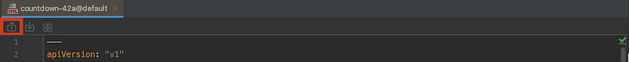

# Kubernetes

## Overview

JetBrains IDEA plugin that allows to browse, create, modify and delete resources on Kubernetes or OpenShift clusters.
The plugin provides functionalities and user experiences that are very close to the Kubernetes extension for vscode (https://marketplace.visualstudio.com/items?itemName=ms-kubernetes-tools.vscode-kubernetes-tools).

It is available for install from the [JetBrains Marketplace](https://plugins.jetbrains.com/plugin/15921-kubernetes-by-red-hat).


> **NOTE:** This plugin is in Preview mode. The plugin support for Kubernetes or OpenShift clusters is strictly experimental - assumptions may break, commands and behavior may change!

## Key Features
 - Edit Kubernetes resource manifests and apply them to your cluster
 - View Kubernetes and OpenShift clusters in an explorer tree view
 - Tree View supports dynamic update of K8s resources
 - Allow Push and Pull Feature to keep the editor in sync with the Kubernetes resource
 - Support Creation and Deletion of new Kubernetes resources on Cluster
 - Navigate into Kubernetes workloads, services, pods and nodes
 - Switching contexts and namespaces within Kubernetes
* Browse Kubernetes and OpenShift cluster resources in dynamically update tree
* Delete resources on cluster
* Edit resources on cluster backed by kubernetes resource schema
* Create new resources on cluster
* Editor kept in sync with the resource on cluster by pushing & pulling

## Features

### Browse Kubernetes & OpenShift resources
This plugin allows the user to view the Kubernetes and OpenShift Cluster resources in the Application Explorer Tree and browser through them.
The explorer tree is dynamically updated in sync with the Kubernetes resources on the cluster so that the tree always display the current state of the resources.

#### Current Context
The tree displays resources that exist on the cluster that the current context points to. 
The user can switch the current context by choosing any context that exists and selecting `Set as Current Cluster` action from the context menu.
OpenShift clusters are shown with OpenShift icon and thus differentiated from Kubernetes clusters.
 
#### Current Namespace/Project
The tree displays resources that exist within the current namespace/project as specified in the kube config. 
Of course resources that live outside the scope of namespace/project are displayed, too.
You can switch the current namespace/project with the context menu item "Use Namespace". 
In OpenShift clusters the tree also lists projects where the tooling behaves in an equivalent manner. 

#### Resource Categories
Resources are grouped in different categories such as Namespaces, Nodes, Workloads, Network, Storage, Configuration and Custom Resources.


#### Pods
Pods are shown with their running state. When running their icon holds a green dot. 
When red, the dot indicates that a pod is either pending, succeeded (terminated), failed or is in an unknown state.
Pods also unveil their IP address and the number of running containers out of the total number of containers.


### Create and Edit Resources
You can edit any existing resource that is shown in the resource tree.
Either double click it or pick "Edit..." in the context menu. 
A Yaml editor opens up and allows you to change the resource. 
Pushing the editor to the cluster then updates the resource that you were editing.
You can also open a local yaml/json file and create a new resource on the cluster by pushing the editor to it.

> **Tip**: You're advised to edit copies of your yaml/json files. 
> This is because the editor keeps your content in sync with the resource that exists on the cluster. 
> Changes that happen on the cluster are included when pushing or pulling the editor.  
    


The editor validates your content on behalf of a schema that's matching your kubernetes resource.
For instance if you're editing a pod, the editor validates it by a kubernetes pod schema and highlights the portions that are infringing.


#### Push (Save) to Cluster

You can push your editor to the cluster in order to update an existing resource or create a new one.
The cluster that the editor is saved to is set in the current context (cluster, namespace and user) that's defined in your kube config.
The editor has a toolbar with an action for this sake.



Alternatively the editor notifies you whenever you may push your content to the cluster.
Clicking the "Push" link in the editor notification saves your editor to the cluster.


Pushing updates the resource on the cluster or creates a new resource if it doesn't exist yet.
The new resource will then appear in the resource tree that's displayed in our tool window.

#### Pull (Load) from Cluster

The editor also notifies you if your resource has changed on the cluster.
The notification informs you of a newer version that is available on the cluster and allows you to "Pull" it into your editor.
If you left your editor unchanged since the last push, the new version is pulled unasked and a notification informs you of it.


Competing changes in your editor and on the cluster get notified with 2 options: 
You can either overwrite the cluster by pushing the editor to the cluster.
Alternatively you can replace your local version with the one on the cluster and pull it.


#### Delete Resources
You may delete any resource that is listed in the resource tree by choosing "Delete" in the context menu.

## Data and Telemetry
The JetBrains IntelliJ Kubernetes plugin collects anonymous [usage data](https://github.com/redhat-developer/intellij-kubernetes/blob/main/USAGE_DATA.md) and sends it to Red Hat servers to help improve our products and services.
Read our [privacy statement](https://developers.redhat.com/article/tool-data-collection) to learn more. This extension respects the Red Hat Telemetry setting which you can learn more about at https://github.com/redhat-developer/intellij-redhat-telemetry#telemetry-reporting


## Release notes
See the change log.

Contributing
============
This is an open source project open to anyone. This project welcomes contributions and suggestions!

For information on getting started, refer to the [CONTRIBUTING instructions](CONTRIBUTING.md).

Feedback & Questions
====================
If you discover an issue please file a bug and we will fix it as soon as possible.
* File a bug in [GitHub Issues](https://github.com/redhat-developer/intellij-kubernetes/issues).

UI Testing
==========
You can perform UI testing by running the following command:
```sh
./gradlew clean runIdeForUiTests -PideaVersion=IC-2020.2& ./gradlew integrationTest
```

License
=======
EPL 2.0, See [LICENSE](LICENSE) for more information.
